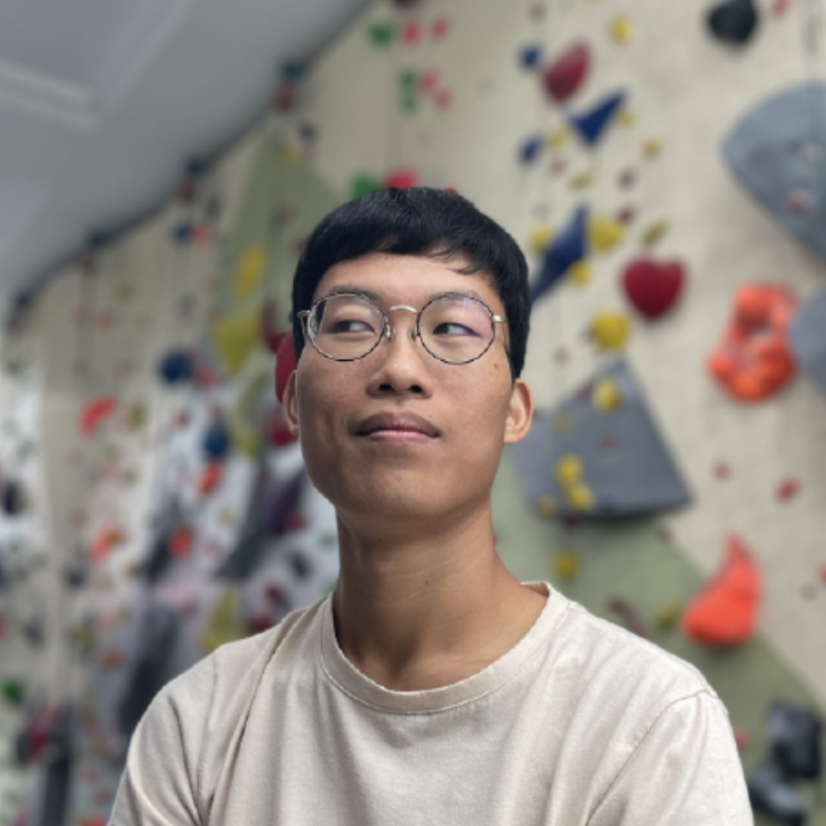
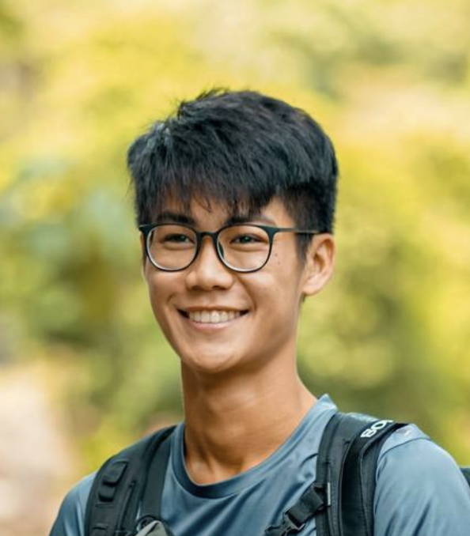
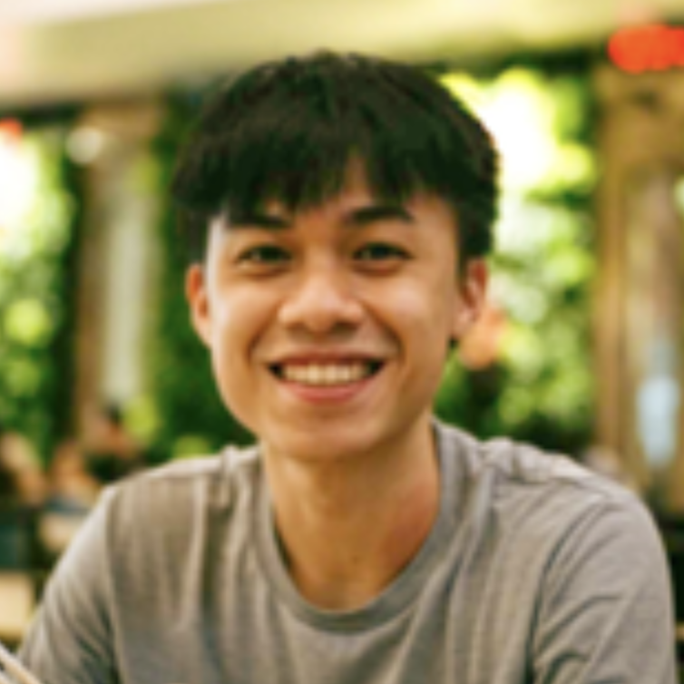
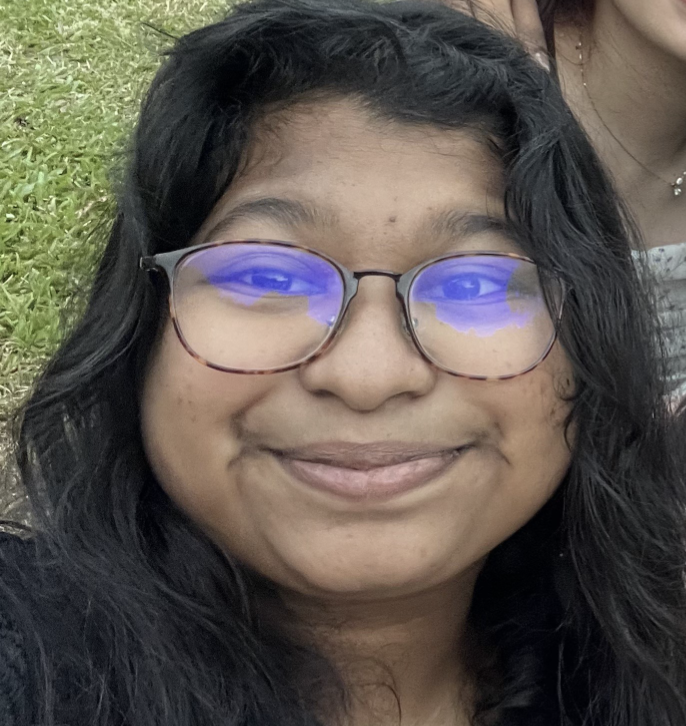
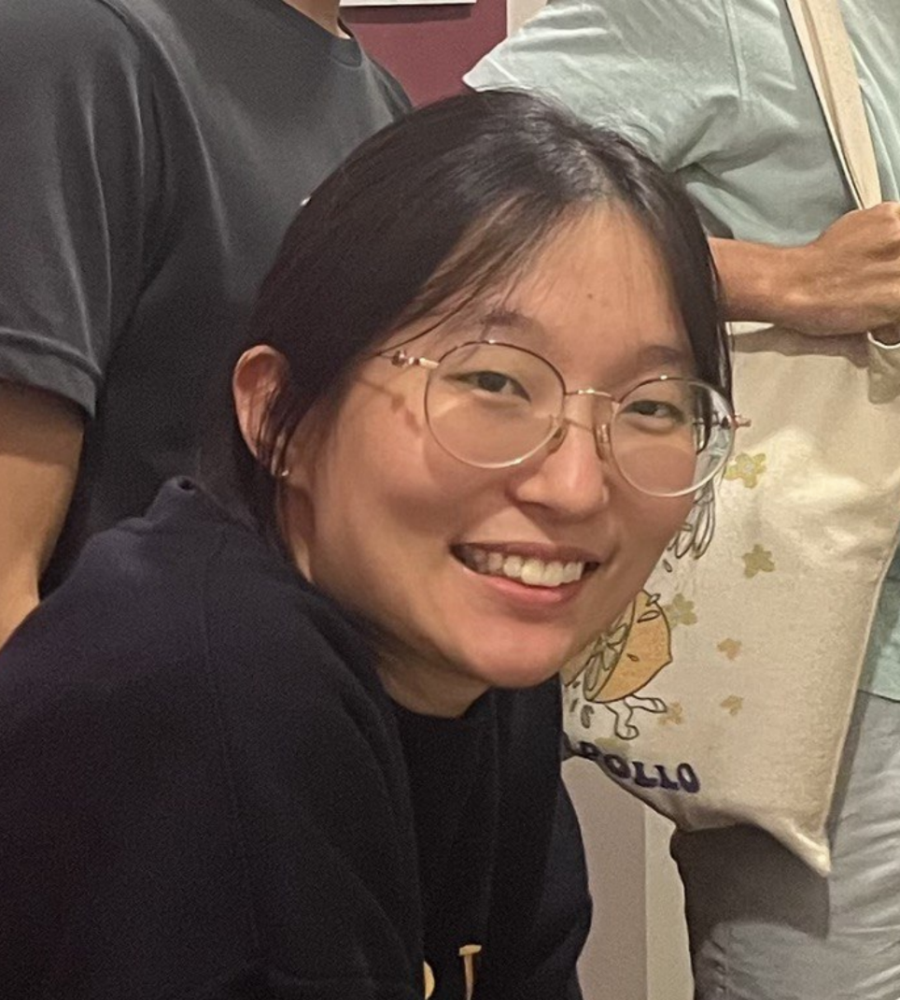

We are a team based in the [School of Computing, National University of Singapore](http://www.comp.nus.edu.sg).

## Project team

### Ravern Koh

[[github](https://github.com/ravern)]
[[portfolio](team/ravern.md)]

* Role: Team Lead
* Responsibilities: UI

### Amos Ting

[[github](http://github.com/amosting)]
[[portfolio](team/amosting.md)]

* Role: Testing
* Responsibilities: UI

### Heng Yi

[[github](http://github.com/lheng1)] [[portfolio](team/lheng1.md)]

* Role: Code Quality
* Responsibilities: Model

### Nabonita Sen

[[github](http://github.com/nabonitasen)]
[[portfolio](team/nabonitasen.md)]

* Role: Deliverables and Deadlines
* Responsibilities: Model

### Amy Ling

[[github](http://github.com/ylyma)]
[[portfolio](team/ylyma.md)]

* Role: Documentation
* Responsibilities: Storage
