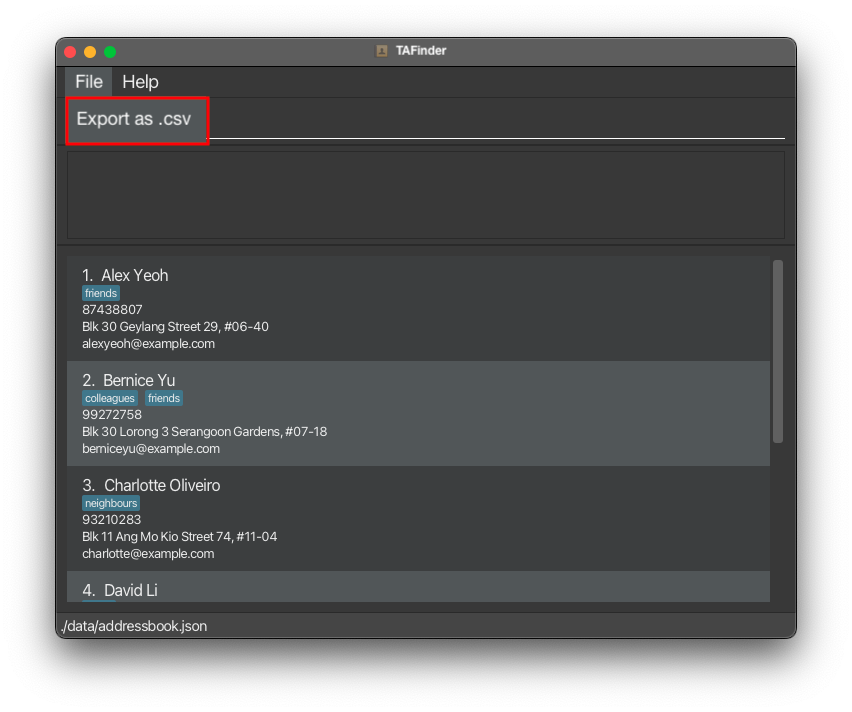

# TAfinder User Guide
## Overview

Introducing **TAfinder - the one-stop solution for all your TA selection needs**.

With TAfinder, you can easily:
1. **Manage** troves of TA applicants.
2. Make more **informed decisions** with the help of our **compare** and **sort** functions.
3. **Import** and **export** data to and from the TAfinder application.

TAfinder utilises a Command Line Interface (CLI), while still enjoying the benefits of a Graphical User Interface (GUI), 
for a more efficient user experience.

So say goodbye to the days of manually sifting through hundreds of TA applications. Enrich your TA selection process with
the power of TAfinder today!

## About This Guide
This guide shows you the relevant information for setting up and using TAfinder to manage your TA applications.

You can click on any of the links below to navigate to the respective sections for more information.

## Table of Contents
- [1 Quick Start](#1-quick-start)
    - [1.1 Prerequisites](#11-prerequisites)
        - [1.1.1 Java](#111-java)
        - [1.1.2 Glossary](#112-glossary)
    - [1.2 Installation](#12-installation)
    - [1.3 Utilisation](#13-utilisation)
    - [1.4 Navigating the User Interface](#14-navigating-the-user-interface)
- [2 Features](#2-features)
    - [2.1 Basic applicant management](#21-basic-applicant-management) 
      - [2.1.1 Adding an applicant: `add`](#211-adding-an-applicant-add)
      - [2.1.2 Editing all applicants: `edit`](#212-editing-an-applicant-edit)
      - [2.1.3 Deleting an applicant: `delete`](#213-deleting-an-applicant-delete)
      - [2.1.4 Listing all applicants: `list`](#214-listing-all-applicant-list)
      - [2.1.5 Viewing an applicant: `view`](#215-viewing-the-details-of-a-single-applicant-view)
      - [2.1.6 Hiding/unhiding an applicant: `hide/unhide`](#216-hiding-an-applicant-from-list-hideunhide)
    - [2.2 Applicant evaluation & comparison](#22-applicant-evaluation--comparison)
      - [2.2.1 Sorting applicants by grades: `sort-gpa`](#221-sorting-applicants-by-gpa-sort-gpa)
      - [2.2.2 Comparing 2 applicants: `compare`](#222-comparing-2-applicants-compare)
      - [2.2.3 Bookmarking/Unbookmarking applicants: `bookmark/unbookmark`](#223-bookmarkingunbookmarking-applicants-bookmarkunbookmark)
      - [2.2.4 Commenting on TA applicant: `comment`](#224-commenting-on-ta-applicant-comment)
    - [2.3 Data management & export](#23-data-management--export)
      - [2.3.1 Exporting applicants into spreadsheet: `export`](#231-exporting-applicants-into-spreadsheet)
      - [2.3.2 Attaching file to applicant profiles: `attach`](#232-attaching-file-to-applicant-profiles)
- [3 Data management](#3-data-management)
    - [3.1 Saving the data](#31-saving-the-data)
    - [3.2 Editing the data file](#32-editing-the-data-file)
- [4 Upcoming Features](#4-upcoming-features-coming-in-v13)
    - [4.1 Importing from spreadsheet: `import`](#41-importing-from-spreadsheet)
    - [4.2 Sorting by module grade: `sort-grade`](#42-sorting-by-module-grade)
    - [4.3 Sorting by interview score: `sort-interview`](#43-sorting-by-interview-score)
- [5 FAQ](#5-faq)
- [6 Known Issues](#6-known-issues)
- [7 Summary](#7-summary)
    - [7.1 Prefix Summary](#71-prefix-summary)
    - [7.2 Command Summary](#72-command-summary)

--------------------------------------------------------------------------------------------------------------------

## 1 Quick start

### 1.1 Prerequisites

#### 1.1.1 Java
Ensure you have [Java `11`](https://www.oracle.com/sg/java/technologies/javase/jdk11-archive-downloads.html) 
or above installed. Java is the language that your computer uses to understand TAfinder.

#### 1.1.2 Glossary

### 1.2 Installation

**Step 1.** Download the latest `tafinder.jar` from [here]().

**Step 2.** Copy the file to the folder you want to use as the _home folder_ for your TAfinder.

**Step 3.** Double-click on the `tafinder.jar` file to start the app. 
The GUI similar to the below should appear in a few seconds. 

### 1.3 Utilisation

**Step 1.** Type the command in the command box and press Enter to execute it. e.g. typing **`help`** and
pressing Enter will open the help window. 
Some example commands you can try:

- `list` : Lists all contacts.

- `add n/John Doe p/98765432 e/johnd@example.com a/John street, block 123, #01-01` : Adds a contact named `John Doe` to the Address Book.

- `delete 3` : Deletes the 3rd contact shown in the current list.

- `clear` : Deletes all contacts.

- `exit` : Exits the app.

Refer to the [Features](#features) below for details of each command.

Step 2. Observe the changes to the application. 

### 1.4 Navigating the User Interface
   

--------------------------------------------------------------------------------------------------------------------

## 2 Features

**Notes about the command format:** 

* Words in `UPPER_CASE` are the parameters to be supplied by the user. 
  e.g. in `add n/NAME`, 
`NAME` is a parameter which can be used as `add n/John Doe`.

* Items in square brackets are optional. 
  e.g `n/NAME [t/TAG]` , 
can be used as `n/John Doe t/friend` or as `n/John Doe`

* Items with `…`​ after them can be used multiple times including zero times. 
  e.g. `[t/TAG]…​`, 
can be used as ` ` (i.e. 0 times), `t/friend`, `t/friend t/family` etc.

* Parameters can be in any order. 
  e.g. if the command specifies `n/NAME p/PHONE_NUMBER`, 
`p/PHONE_NUMBER n/NAME` is also acceptable.

* Extraneous parameters will be ignored. 
  e.g. if the command specifies `help 123`, it will be interpreted as `help`.

* If you are using a PDF version of this document, be careful when copying and pasting commands that span multiple 
lines as space characters surrounding line-breaks may be omitted when copied over to the application.

---

### **2.1 Basic applicant management**

#### 2.1.1 Adding an applicant: `add`

<aside>
⭐ Adds a new applicant to the list of applicants.

</aside>

**Format:** `add [n/NAME] [p/PHONE] [e/EMAIL] [g/GPA] [t/TAG]…`

- **`n/NAME`**: Name of the applicant.
- **`p/PHONE`**: Phone number of the applicant.
- **`e/EMAIL`**: Email address of the applicant.
- **`g/GPA`**: GPA of the applicant.
- **`t/TAG`**: Tags of the applicant. Note that editing tags will replace existing tags; it is not cumulative.

**Examples:**

- **`add n/john doe p/91234567 e/johndoe@example.com g/5.0 t/past TA, dean's list`**
    - Adds a person with the following information
        - Name: John Doe
        - Phone number: 91234567
        - Email address: johndoe@example.com
        - GPA: 5.0
        - Tags: past TA, dean’s list
- **`add n/amanda p/89064678 e/amanda@example.com g/4.3`**
    - Adds a person with the following information
        - Name: Amanda
        - Phone number: 89064678
        - Email address: amanda@example.com
        - GPA: 4.3

**Expected Outputs:**

- The applicant and applicant’s information has been successfully added
- Confirmation message: **`"Applicant added successfully with the following details: Name: <name>, Phone Number: <phone number>, Email: <email>, GPA: <gpa>, tags: <tags>"`**

**Errors:**

- Missing fields: **`"Error: Missing fields. Please follow the format: add [n/NAME] [p/PHONE] [e/EMAIL] [g/GPA] [t/TAG]…"`**
- Repeated applicant: **`"Error: Repeated applicant. Applicant has already been added to the list`**

**Format:** **`list`**

- **`list-hidden`** Shows a list of all hidden applicants.
- **`list-bookmarked`** Shows a list of all bookmarked applicants.

---

#### 2.1.2 Editing an applicant: `edit`

<aside>
⭐ Edits an existing applicant in the list of applicants.

</aside>

**Format:** `edit INDEX [n/NAME] [p/PHONE] [e/EMAIL] [g/GPA] [t/TAG]…`

- `INDEX`: The index of the applicant to edit. The index must be a positive integer (e.g., 1, 2, 3…).
- `[optional fields]`: **At least one** of the following optional fields must be provided for editing:
    - **`n/NAME`**: Name of the applicant.
    - **`p/PHONE`**: Phone number of the applicant.
    - **`e/EMAIL`**: Email address of the applicant.
    - **`g/GPA`**: GPA of the applicant.
    - **`t/TAG`**: Tags of the applicant. Note that editing tags will replace existing tags; it is not cumulative.
    - To remove all existing tags, use **`t/`** without specifying any tags after it.

**Examples:**

- **`edit 1 p/91234567 e/johndoe@example.com`**
    - Edits the phone number and email address of the 1st person to be **`91234567`** and **`johndoe@example.com`**, respectively.
- **`edit 2 n/Betsy Crower t/`**
    - Edits the name of the 2nd person to be **`Betsy Crower`** and clears all existing tags.

---

#### 2.1.3 Deleting an applicant: `delete` 

---

#### 2.1.4 Listing all applicant: `list`

<aside>
⭐ Shows a list of all applicants.

</aside>

**Format:** `list`

- `list-hidden` Shows a list of all hidden applicants.
- `list-bookmarked` Shows a list of all bookmarked applicants.

---

#### 2.1.5 Viewing the details of a single applicant: `view`

<aside>
⭐ Displays a single applicant.

</aside>

**Format:** `view INDEX`

- `INDEX`: The index corresponding to the applicant to be displayed. The index must be a positive integer (e.g., 1, 2, 3…).

**Examples:**

- **`view 3`**
    - Displays the following details about the third applicant.
      - Name
      - Phone number
      - Email Address
      - GPA
      - Tags

**Expected Outputs:**

- All details of an applicant in the following format:\
    `Name: John Doe`\
    `Phone Number: 91234567`\
    `Email Address: johndoe@example.come`\
    `GPA: 5.0`\
    `Tags: pastTA, deansList`

**Errors:**

- Missing index: **`"Error: Missing index. Please follow the format: 'view INDEX'."`**
- Index out of range: **`"Error: Invalid index. Please enter an index within range."`**

---
#### 2.1.6 Hiding an applicant from list: `hide`/`unhide`

<aside>
⭐ Hides/unhides an applicant from the list of applicants.

</aside>

**Format:** `hide INDEX` / `unhide INDEX`

- Hides/unhides the applicant at the specified INDEX from all future lists. The index refers to the number shown in the displayed person list.
    - The index must be a positive integer 1, 2, 3...
- `unhide-all` unhides all applicants that were previously hidden.

**Examples:**

- **`hide 2`**
    - Hides the applicant at index 2
- **`unhide 2`**
    - Unhides the applicant at index 2
- **`unhide-all`**
    - Unhides all applicants

**Expected Outputs:**

- Confirmation message: `APPLICANT_NAME hidden successfully.`

**Errors:**

- Missing index: **`"Error: Missing index. Please follow the format: hide INDEX"`**
- Index out of range: **`“Error: Invalid index. Please enter an index within range”`**

---

### **2.2 Applicant evaluation & comparison**

#### 2.2.1 Sorting applicants by GPA: `sort-gpa`

<aside>
⭐  Sorts applicants by grades in descending order

</aside>

**Format:** **`sort-gpa`**

**Expected Output:**

- A list of applicants sorted by grades in descending order.

**Errors:**

- Empty list: `"Error: Empty list. No applicants to sort."`

---

#### 2.2.2 Comparing 2 applicants: `compare`

<aside>
⭐  Compares two applicants side by side to make informed decisions.

</aside>

**Format:** **`compare INDEX1 INDEX2`**

- **`INDEX1`**: The index of the first applicant to compare.
- **`INDEX2`**: The index of the second applicant to compare.
- Both indices must be a positive integer (e.g., 1, 2, 3…), and should not be the same.

**Examples:**

- **`compare 1 2`**
    - Compares the first and second applicants.

**Expected Output:**

- A side-by-side comparison of the two applicants is displayed in a user-friendly format. This comparison will include various TA selection criteria such as name, GPA, CCA count, Interview Performance Rating (IPR), tags, etc.
- The system highlights the differences between the two applicants, making it easy to see variations in their profiles.

**Errors:**

- Missing or invalid indices: **`"Error: Please provide valid indices for both applicants. Follow the format: compare INDEX1 INDEX2."`**
- Applicant not found: **`"Error: One or both of the specified applicants were not found in the list."`**
- Comparing the same applicant: **`"Error: Please provide distinct indices. You cannot compare the same applicant."`**

---

#### 2.2.3 Bookmarking/Unbookmarking applicants: `bookmark/unbookmark`

<aside>
⭐  Bookmarks/Unbookmarks a specific applicant.

</aside>

**Format:** **`bookmark INDEX` / `unbookmark INDEX`**

- **`INDEX`**: The index corresponding to the applicant to be bookmarked/unbookmarked. The index must be a positive integer (e.g., 1, 2, 3…).

**Examples:**

- **`bookmark 3`**
    - Bookmarks the third applicant.
- **`unbookmark 3`**
    - Unbookmarks the third applicant.

**Expected Output:**

- Applicant corresponding to the given index is bookmarked/unbookmarked.
- Confirmation message: `"Applicant at index INDEX has been successfully bookmarked/unbookmarked."`

**Errors:**

- Missing index: **`"Error: Missing index. Please follow the format: 'view INDEX'."`**
- Index out of range: **`"Error: Invalid index. Please enter an index within range."`**

---

#### 2.2.4 Commenting on TA applicant: **`comment`**

<aside>
⭐ Add comments on a specific applicant

</aside>

**Format: `comment INDEX COMMENT`**

- `INDEX`: The index corresponding to the applicant to be commented. The index must be a positive integer (e.g., 1, 2, 3…).
- **`COMMENT`:** The comment to be made about the applicant.

**Examples:**

- `comment 3 This applicant has an OHS disciplinary record`
    - Comments on the third applicant.

**Expected outputs:**

- Applicant corresponding to the given index is commented.
- Confirmation message: `"Applicant at index INDEX has been successfully commented on."`

**Errors:**

- Missing index: `**“Error: Missing index. Please follow the format: 'view INDEX'.”**`
- Index out of range: `**“Error: Invalid index. Please enter an index within range.”**`

---

### 2.3 Data management & export

#### 2.3.1 Exporting applicants into spreadsheet

<aside>
⭐  Exports the entire list of applicants along with their details into a spreadsheet
</aside>

**Format:** **`export FILENAME`**

- `FILENAME`: The desired filename of the spreadsheet (including the file extension)

**Examples:**

- `export ta-applicants.csv`
    - Exports the entire list of applicants in the CSV format to a file called `ta-applicants.csv` in the same directory as the JAR file

**Expected Output:**

- A toast indicating whether the export was successful.
- If the export wasn’t successful, the reason why it wasn’t successful should be included in the toast.

**Errors:**

- Missing file permissions: **`"Error: No permission to write to file FILENAME."`**
- Corrupted data: **`"Error: Data is corrupted, failed to write to file FILENAME."`**
- Any other unexpected error: **`"Error: Unknown error. Please contact the app developer at contact@email.com"`**

---

#### 2.3.2 Attaching file to applicant profiles

<aside>
⭐  Attaches local files to the profiles of applicants to provide even more richness and insight into their applications
</aside>

**Format:** **`attach INDEX FILEPATH`**

- `INDEX`: The index of the applicant to edit. The index must be a positive integer (e.g., 1, 2, 3…).
- `FILEPATH`: The desired path of the file to attach to the applicant’s profile. This is relative to the path of the JAR file unless either `/` or `C:\` is at the start of the path, then the path will be treated as an absolute path.

**Examples:**

- `attach 2 john-resume.pdf`
    - Attaches the file called `john-resume.pdf` in the same directory as the JAR file to the second applicant in the applicant list
- `attach 78 /home/jennifer/resumes/benson-resume.pdf`
    - Attaches the file called `benson-resume.pdf` in the directory `/home/jennifer/resumes` to the 78th applicant in the applicant list

**Expected Output:**

- A toast indicating whether the export was successful.
- If the export wasn’t successful, the reason why it wasn’t successful should be included in the toast.

**Errors:**

- Missing file permissions: **`"Error: No permission to read from file FILEPATH."`**
- Corrupted data: **`"Error: Data is corrupted, failed to attach file FILEPATH."`**
- Any other unexpected error: **`"Error: Unknown error. Please contact the app developer at contact@email.com"`**

---
## 3 Data Management
### 3.1 Saving the data

TAFinder data are saved in the hard disk automatically after any command that changes the data. There is no need to save manually.

### 3.2 Editing the data file

TAFinder data are saved automatically as a JSON file `[JAR file location]/data/tafinder.json`. Advanced users are welcome to update data directly by editing that data file.

:exclamation: **Caution:**
If your changes to the data file makes its format invalid, TAFinder will discard all data and start with an empty data file at the next run. Hence, it is recommended to take a backup of the file before editing it.

--------------------------------------------------------------------------------------------------------------------
## 4 Upcoming Features [coming in v1.3]
### 4.1 Importing from spreadsheet

### 4.2 Sorting by module grade

### 4.3 Sorting by interview score

--------------------------------------------------------------------------------------------------------------------

## 5 FAQ

**Q**: How do I transfer my data to another Computer? 
**A**: Install the app in the other computer and overwrite the empty data file it creates with the file that contains the data of your previous AddressBook home folder.

--------------------------------------------------------------------------------------------------------------------

## 6 Known Issues

1. **When using multiple screens**, if you move the application to a secondary screen, and later switch to using only the primary screen, the GUI will open off-screen. The remedy is to delete the `preferences.json` file created by the application before running the application again.

--------------------------------------------------------------------------------------------------------------------
## 7 Summary
### 7.1 Prefix Summary

### 7.2 Command Summary

| Action     | Format, Examples                                                                                                                                                      |
|------------|-----------------------------------------------------------------------------------------------------------------------------------------------------------------------|
| **Add**    | `add n/NAME p/PHONE_NUMBER e/EMAIL a/ADDRESS [t/TAG]…​`   e.g., `add n/James Ho p/22224444 e/jamesho@example.com a/123, Clementi Rd, 1234665 t/friend t/colleague` |
| **Clear**  | `clear`                                                                                                                                                               |
| **Delete** | `delete INDEX`  e.g., `delete 3`                                                                                                                                   |
| **Edit**   | `edit INDEX [n/NAME] [p/PHONE_NUMBER] [e/EMAIL] [a/ADDRESS] [t/TAG]…​`  e.g.,`edit 2 n/James Lee e/jameslee@example.com`                                           |
| **Find**   | `find KEYWORD [MORE_KEYWORDS]`  e.g., `find James Jake`                                                                                                            |
| **List**   | `list`                                                                                                                                                                |
| **Help**   | `help`                                                                                                                                                                |
