## Overview

Introducing **TAfinder - the one-stop solution for all your TA selection needs**.

With TAfinder, you can easily:
1. **Manage** troves of TA applicants.
2. Make more **informed decisions** with the help of our **compare** and **sort** functions.
3. **Import** data to the TAfinder application.

TAfinder utilises a Command Line Interface (CLI), while still enjoying the benefits of a Graphical User Interface (GUI),
for a more efficient user experience.

So say goodbye to the days of manually sifting through hundreds of TA applications. Enrich your TA selection process with
the power of TAfinder today!

## About This Guide

This guide shows you the relevant information for setting up and using TAfinder to manage your TA applications.

You can click on any of the links below to navigate to the respective sections for more information.



## Quick start

### Prerequisites

#### Java
Ensure you have [Java `11`](https://www.oracle.com/sg/java/technologies/javase/jdk11-archive-downloads.html)
or above installed. Java is the language that your computer uses to understand TAfinder.

<div markdown="block" class="alert alert-secondary">

**:bulb: Not sure how to check your Java version?**

**Step 1.** Open up **Command Prompt** (Windows) or **Terminal** (Mac and Linux).

**Step 2.** Type and run the command `java -version`.

**Step 3.** Check the version number provided (`xxx`) is at least `11`.

An example is shown below.

  ```
  > java -version
  java version "xxx" <Other information>
  ```

</div>

<div style="page-break-after: always;"></div>

#### Glossary

| Words/Abbreviations | Explanation                                                                                                                         |
|---------------------|-------------------------------------------------------------------------------------------------------------------------------------|
| **TA**              | Teaching Assistant                                                                                                                  |
| **Applicant**       | Applicant refers to a student who has applied as a TA                                                                               |
| **Mainstream OS**   | Windows, Linux or Mac                                                                                                               |
| **CLI**             | Command-Line Interface                                                                                                              |
| **GUI**             | Graphical User Interface                                                                                                            |
| **Toast**           | A popup alert to inform users about certain information                                                                             |
| **Tag**             | Tags are associated with applicants, users can tag applicants with any keyword they want,<br/>the number of tags are not restricted |

### Installation

**Step 1.** Download the latest `tafinder.jar` from [here]().

**Step 2.** Copy the file to the folder you want to use as the _home folder_ for your TAfinder.

**Step 3.** Double-click on the `tafinder.jar` file to start the app.

<div markdown="block" class="alert alert-secondary">

**:bulb: TAfinder does not open?**

**Step 1.** Open a command terminal.

**Step 2.** Type in `java -jar ` (Keep in mind of the space at the end).

**Step 3.** Drag and drop `tafinder.jar` into the command terminal.

**Step 4.** Press enter and execute the command.

An example of the final command is displayed below.

  ```
  > java -jar xxxx/xxxx/tafinder.jar
  ```

</div>

The GUI similar to the below should appear in a few seconds. 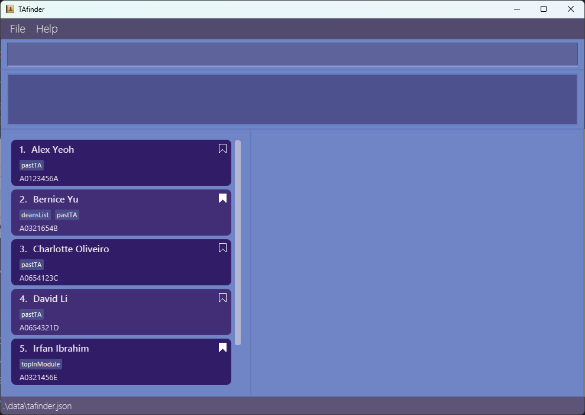

### Utilisation

**Step 1:** Type the command in the Command Input Box and press Enter to execute it. e.g. typing **`help`** and
pressing Enter will open the help window.<br>
Some example commands you can try:

- `list` : Lists all contacts.

- `add n/John Doe p/98765432 e/johnd@example.com a/John street, block 123, #01-01` : Adds a contact named `John Doe` to the Address Book.

- `delete 3` : Deletes the 3rd contact shown in the current list.

- `clear` : Deletes all contacts.

- `exit` : Exits the app.

**Step 2:** Observe the changes to the application.<br>

<div markdown="block" class="alert alert-secondary">

**:bulb: Not sure what the commands above does?**

You can find all about the usable commands [here](#2-features),<br>
look at a summary of all the usable commands [here](#72-command-summary),<br>
OR return to the [Table of Contents](#table-of-contents) to find your desired command.

</div>

### Navigating the User Interface

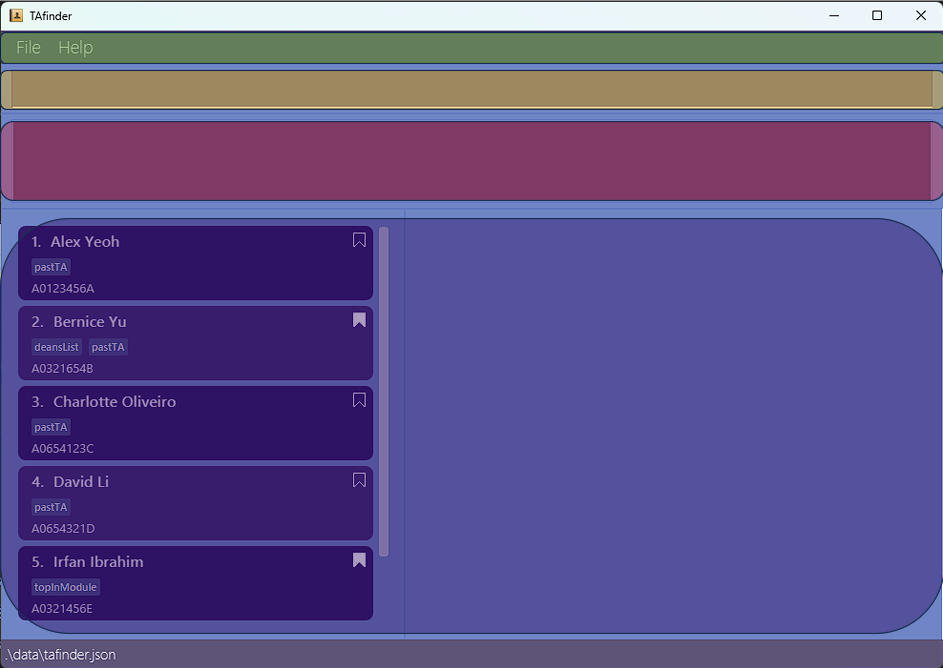

The UI has the following areas:
- <span style="background-color:#70AD47">Navigation bar</span>
  - This is where you can navigate to the `File` and `Help` menus.
- <span style="background-color:#FFC000">Command Input Box</span>
  - This where commands are typed
  - press `Enter` to execute it.
- <span style="background-color:#FF0000">Command Result Screen</span>
  - This is where the result of the command is displayed. Applicants are displayed in a list format.
- <span style="background-color:#2A035D">Applicant list</span>
  - This is where the list of applicants is displayed.

--------------------------------------------------------------------------------------------------------------------

## Features

<div markdown="block" class="alert alert-info">

**:information_source: Notes about the command format:**<br>

* Words in `UPPER_CASE` are the parameters to be supplied by the user.<br>
  e.g. in `add n/NAME`,<br>
`NAME` is a parameter which can be used as `add n/John Doe`.


* Items in square brackets are optional.<br>
  e.g `n/NAME [t/TAG]` ,<br>
can be used as `n/John Doe t/friend` or as `n/John Doe`


* Items with `…`​ after them can be used multiple times including zero times.<br>
  e.g. `[t/TAG]…​`,<br>
can be used as ` ` (i.e. 0 times), `t/friend`, `t/friend t/family` etc.


* Parameters can be in any order.<br>
  e.g. if the command specifies `n/NAME p/PHONE_NUMBER`,<br>
`p/PHONE_NUMBER n/NAME` is also acceptable.


* Extraneous parameters will be ignored.<br>
  e.g. if the command specifies `help 123`, it will be interpreted as `help`.


* If you are using a PDF version of this document, be careful when copying and pasting commands that span multiple
lines as space characters surrounding line-breaks may be omitted when copied over to the application.

</div>

---

### Basic applicant management

#### Adding an applicant: `add`

You have just finished setting up TAfinder and you are ready to add your first applicant.
Let's find out how you can add the applicant to the list.

**Format:**

<div markdown="block" class="alert alert-info">

**`add s/STUDENT_NUMBER n/NAME p/PHONE e/EMAIL g/GPA [pg/PREVIOUS_GRADE] [is/INTERVIEW_SCORE] [c/COMMENT] [t/TAG]…`**

- **`s/STUDENT_NUMBER`**: Student number of the applicant
- **`n/NAME`**: Name of the applicant.
- **`p/PHONE`**: Phone number of the applicant.
- **`e/EMAIL`**: Email address of the applicant.
- **`g/GPA`**: GPA of the applicant.
- **`pg/PREVIOUS_GRADE`**: Previous grade of the applicant.
- **`[is/INTERVIEW_SCORE]`**: Interview score of the applicant.
- **`[c/COMMENT]`**: Comments for the applicant.
- **`[t/TAG]`**: Tags of the applicant.

</div>

<div markdown="block" class="alert alert-primary">

:bulb: You can add more than 1 tag to an applicant by adding more `t/TAG` parameters.

</div>

Here are some examples you can try with the `add` command.

**Examples:**

<div markdown="block" class="alert alert-secondary">

**`add s/A0251647W n/amanda p/89064678 e/amanda@example.com g/4.3 pg/A`**
- Adds an applicant with the following information:
    - **Student number**: A0251647W
    - **Name**: Amanda
    - **Phone number**: 89064678
    - **Email address**: amanda@example.com
    - **GPA**: 4.3
    - **Previous grade**: A

</div>

<div markdown="block" class="alert alert-secondary">

**`add s/A0269357C n/john doe p/91234567 e/johndoe@example.com g/5.0 pg/A- is/8.9 c/Hardworking t/pastTA t/deanslist`**
- Adds an applicant with the following information:
    - **Student number**: A0269357C
    - **Name**: John Doe
    - **Phone number**: 91234567
    - **Email address**: johndoe@example.com
    - **GPA**: 5.0
    - **Previous grade**: A-
    - **Interview score**: 8.9
    - **Comment**: Hardworking
    - **Tags**: pastTA, deanslist

</div>

Following the example above, if you entered everything correctly, you should see the following:

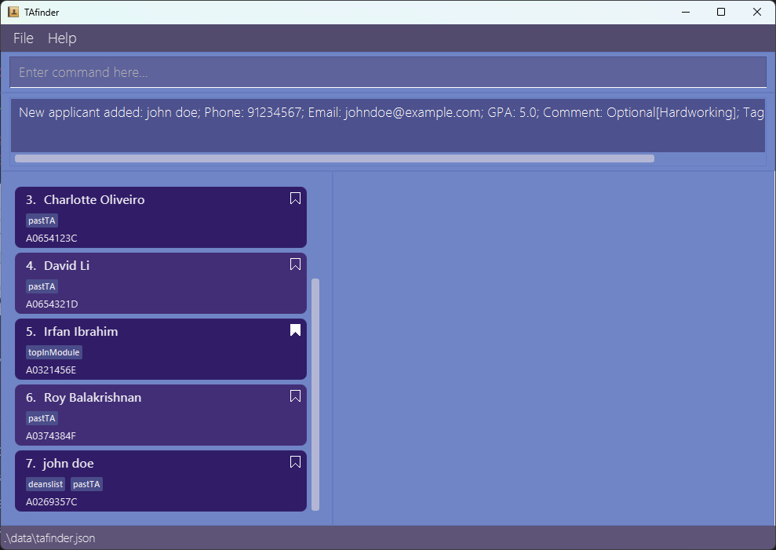

You have now successfully added your first applicant to the list. As you add more applicants to the list,
watch out for the expected and erroneous messages below that could be displayed in the command result screen!

**Expected Outputs:**

<div markdown="block" class="alert alert-success">

Successfully added applicant and the applicant's information:<br>
**`"New applicant added: Student number: <student number>; Name: <name>; Phone: <phone>;
Email: <email>; GPA: <gpa>; Previous grade: <previous grade>; [Interview score: <interview score>];
[Comment: <comment>]; [Tags: <tags>]."`**

</div>

**Erroneous Outputs:**

<div markdown="block" class="alert alert-danger">

Invalid command format:<br>
**`"Invalid command format!"`<br>
`"add: Adds an applicant to the list. Parameters: s/STUDENT NUMBER n/NAME p/PHONE e/EMAIL g/GPA pg/PREV GRADE
[is/INTERVIEW SCORE] [c/COMMENT] [t/TAG]..."`<br>
`"Example: add s/A0343434C n/John Doe p/98765432 e/johnd@example.com g/4.9 pg/A is/9.1 c/Hardworking and diligent t/pastTA "`**

</div>

<div markdown="block" class="alert alert-danger">

Repeated applicant:<br>
**`"This applicant already exists in the applicant list."`**

</div>

---

#### Editing an applicant: `edit`

Edits an existing applicant in the list of applicants.


**Format:**

<div markdown="block" class="alert alert-info">

**`edit INDEX [s/STUDENT NUMBER] [n/NAME] [p/PHONE] [e/EMAIL] [g/GPA] [c/comment] [t/TAG]…`**

- **`INDEX`**: The index of the applicant to edit. The index must be a positive integer (e.g., 1, 2, 3…).

- `[optional fields]`: **At least one** of the following optional fields must be provided for editing:
    - **`s/STUDENT NUMBER`**: Student number of the applicant.
    - **`n/NAME`**: Name of the applicant.
    - **`p/PHONE`**: Phone number of the applicant.
    - **`e/EMAIL`**: Email address of the applicant.
    - **`g/GPA`**: GPA of the applicant.
    - **`c/comment`**: Comment of the applicant.
    - **`t/TAG`**: Tags of the applicant. Note that editing tags will replace existing tags; it is not cumulative.
    - To remove all existing tags, use **`t/`** without specifying any tags after it.

</div>

**Examples:**

<div markdown="block" class="alert alert-secondary">

**`edit 1 p/91234567 e/johndoe@example.com`**
- Edits the following fields of the first person in the list:
  - **Phone number**: **`91234567`**
  - **Email address**: **`johndoe@example.com`**

</div>

<div markdown="block" class="alert alert-secondary">

**`edit 2 n/Betsy Crower t/`**
- Edits the following fields of the second person in the list:
  - **Name**: **`Betsy Crower`**
  - Clears all existing tags

</div>

**Expected Outputs:**

<div markdown="block" class="alert alert-success">

Successfully editing applicant and applicant's information.<br>
Confirmation message:<br>
  **`"Edited applicant: Student number: <student number>; Name: <name>; Phone: <phone>; Email: <email>; GPA: <gpa>; Comment: <comment>; Tags: <tags>"`**

</div>

**Erroneous Outputs:**

<div markdown="block" class="alert alert-danger">

Invalid command format:<br>
  `"Invalid command format!`<br>
  `edit: Edits the details of the applicant identified by the index number used in the displayed applicant list. Existing values will be overwritten by the input values.`<br>
  `Parameters: INDEX (must be a positive integer) [n/NAME] [p/PHONE] [e/EMAIL] [g/GPA] [c/COMMENT] [t/TAG]..."`

</div>

<div markdown="block" class="alert alert-danger">

Index out of range:<br>
**`"Error: Invalid index. Please enter an index within range."`**

</div>

---

#### Deleting an applicant: `delete`

Delete a singular existing applicant in the list of applicants.=

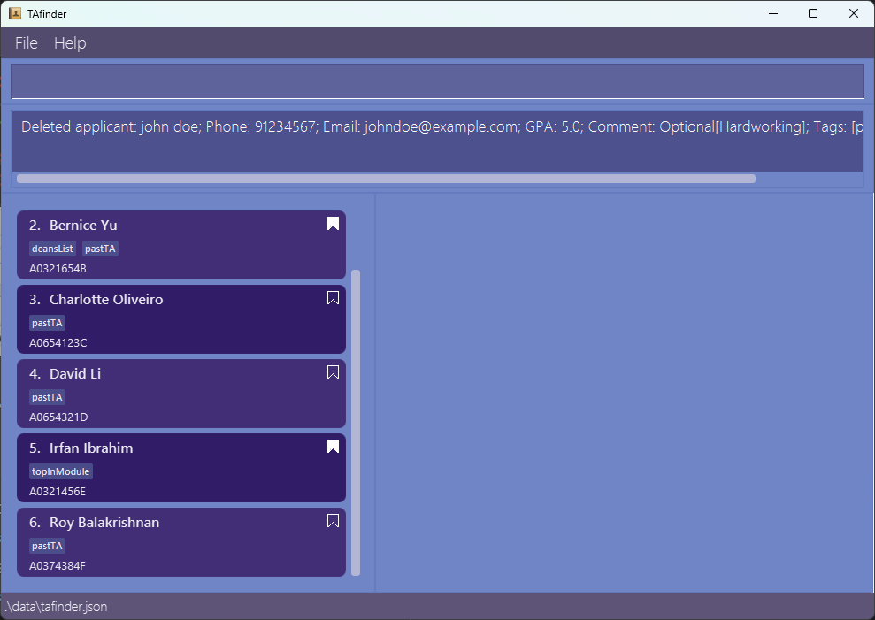

**Format:**

<div markdown="block" class="alert alert-info">

**`delete INDEX`**

**`INDEX`**: The index corresponding to the applicant to be deleted. The index must be a positive integer (e.g., 1, 2, 3…).

</div>

**Examples:**

<div markdown="block" class="alert alert-secondary">

**`delete 3`**
- Deletes the third applicant in the list.

</div>

**Expected Outputs:**

<div markdown="block" class="alert alert-success">

Successfully delete applicant and applicant's information at the given index.<br>
Confirmation message:<br>
**`"Deleted applicant: Student number: <student number>; Name: <name>; Phone: <phone>; Email: <email>; GPA: <gpa>; Comment: <comment> ; Tags: <tags>"`**

</div>

**Erroneous Outputs:**

<div markdown="block" class="alert alert-danger">

Missing index: <br>
  **`"Invalid command format!`<br>
  `delete: Displays the applicant identified by the index number used in the displayed applicant list.`<br>
  `Parameters: INDEX (must be a positive integer)`<br>
  `Example: delete 1"`**

</div>

<div markdown="block" class="alert alert-danger">

Index out of range:<br>
  **`"Error: Invalid index. Please enter an index within range."`**

</div>

---

#### Listing all applicant: `list`

Shows a list of applicants.

**Format:**

<div markdown="block" class="alert alert-info">

**`list`** / **`list hidden`** / **`list bookmarked`**

</div>

<div markdown="block" class="alert alert-info">

**`list`**
- Shows a list of all applicants.

</div>

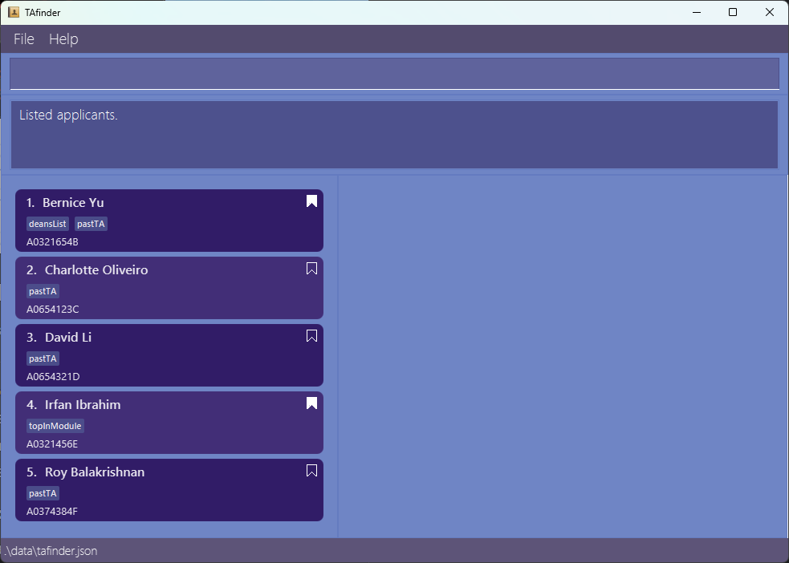

<div markdown="block" class="alert alert-info">

**`list hidden`**
- Shows a list of all hidden applicants.

</div>

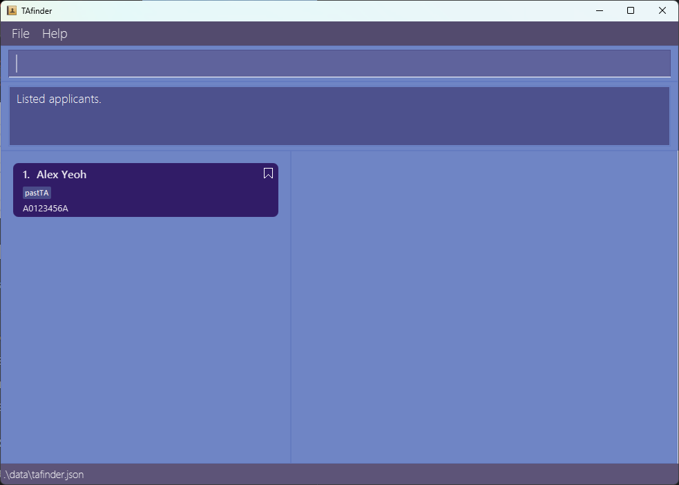

<div markdown="block" class="alert alert-info">

**`list bookmarked`**
- Shows a list of all bookmarked applicants.

</div>

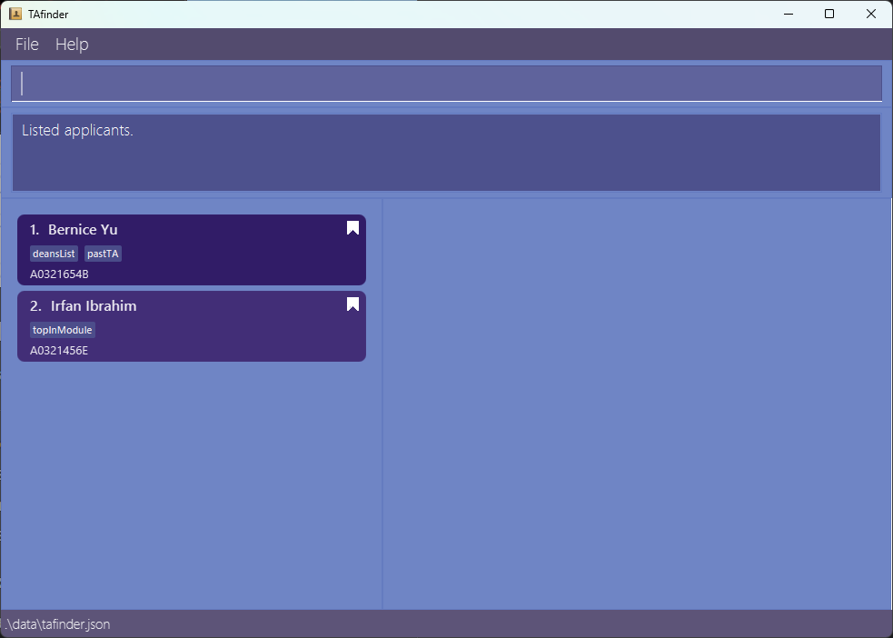

---

#### Viewing the details of a single applicant: `view`

Displays a single applicant.


**Format:**

<div markdown="block" class="alert alert-info">

**`view INDEX`**

**`INDEX`**: The index corresponding to the applicant to be displayed. The index must be a positive integer (e.g., 1, 2, 3…).

</div>

**Examples:**

<div markdown="block" class="alert alert-secondary">

**`view 3`**
- Displays the following details about the third applicant.
  - Name
  - Student number
  - Phone number
  - Email Address
  - GPA
  - Comments
  - Tags

</div>

**Expected Outputs:**

<div markdown="block" class="alert alert-success">

Successfully displaying all details of an applicant in the following format:
- **`Name: John Doe`**
- **`Student number: A0358289S`**
- **`Phone Number: 91234567`**
- **`Email Address: johndoe@example.come`**
- **`GPA: 5.0`**
- **`Comments: Good fit, has teaching experience`**
- **`Tags: pastTA, deansList`**

Confirmation message:<br>
**`"Displaying: APPLICANT_NAME"`**

</div>

**Erroneous Outputs:**

<div markdown="block" class="alert alert-danger">

Missing index: <br>
**`"Invalid command format!`<br>
  `view: Displays the applicant identified by the index number used in the displayed applicant list.`<br>
  `Parameters: INDEX (must be a positive integer)`<br>
  `Example: view 1"`**

</div>

<div markdown="block" class="alert alert-danger">

Index out of range:<br>
**`"Error: Invalid index. Please enter an index within range."`**

</div>

---

#### Hiding an applicant from list: `hide`/`unhide`

Hides/unhides an applicant from the list of applicants.

**Format:** 

<div markdown="block" class="alert alert-info">

`hide INDEX` / `unhide INDEX` / `unhide-all`

</div>

<div markdown="block" class="alert alert-info">

`hide INDEX`
- Hides the applicant at the specified INDEX from all future lists. The index refers to the number shown in the displayed person list.</br>
  Index must be a positive integer (e.g. 1, 2, 3...).

</div>

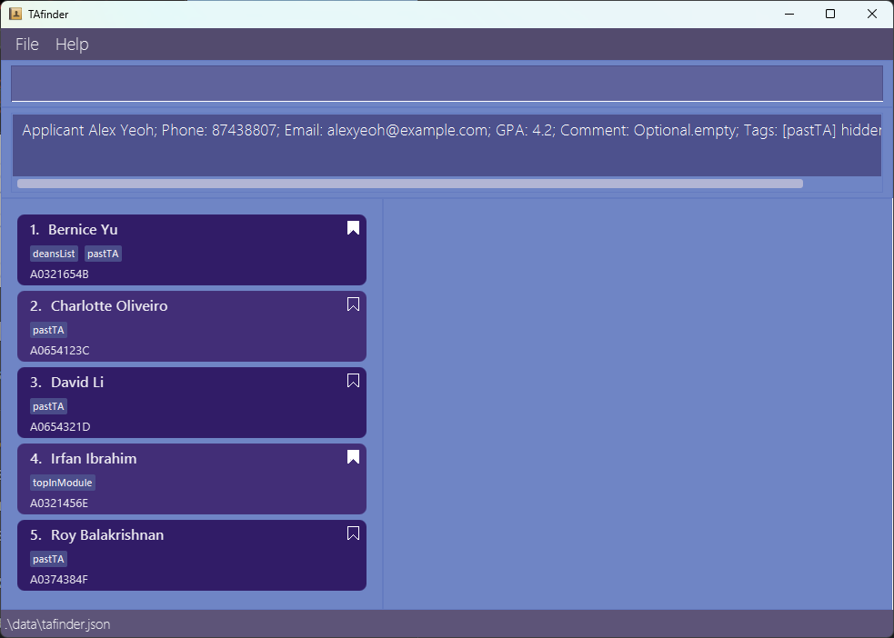

<div markdown="block" class="alert alert-info">

`unhide INDEX`
- Unhides the applicant at the specified INDEX from all future lists. The index refers to the number shown in the displayed person list. </br>
Index must be a positive integer (e.g. 1, 2, 3...).

</div>

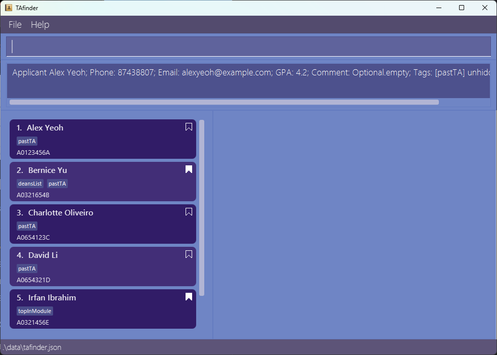

<div markdown="block" class="alert alert-info">

`unhide-all`
- Unhides all applicants that were previously hidden.

</div>


**Examples:**

<div markdown="block" class="alert alert-secondary">

**`hide 2`**
- Hides the applicant at index 2.

</div>

<div markdown="block" class="alert alert-secondary">

**`list hidden` then `unhide 2`**
- Lists all hidden applicants, then unhides the applicant at index 2 in the list of hidden applicants.

</div>

<div markdown="block" class="alert alert-secondary">

**`unhide-all`**
- Unhides all applicants.

</div>

**Expected Outputs:**

<div markdown="block" class="alert alert-success">

Successfully hiding/unhiding applicant(s).<br>
Confirmation message:<br>
**`APPLICANT_NAME hidden successfully.`**

</div>

**Erroneous Outputs:**

<div markdown="block" class="alert alert-danger">

Missing index:<br>
**`"Invalid command format!`<br>
  `hide: Hides an applicant, identified by the index number used in the last list, from all future lists of applicants.`<br>
  `Parameter: INDEX (must be a positive integer)`<br>
  `Example: hide 1"`**

</div>

<div markdown="block" class="alert alert-danger">

Index out of range:<br>
**`“Error: Invalid index. Please enter an index within range.”`**

</div>

---

### Applicant evaluation & comparison

#### Sorting applicants by GPA: `sort`

Sorts applicants by a field

|              Before                |               After                |
|:----------------------------------:|:----------------------------------:|
| 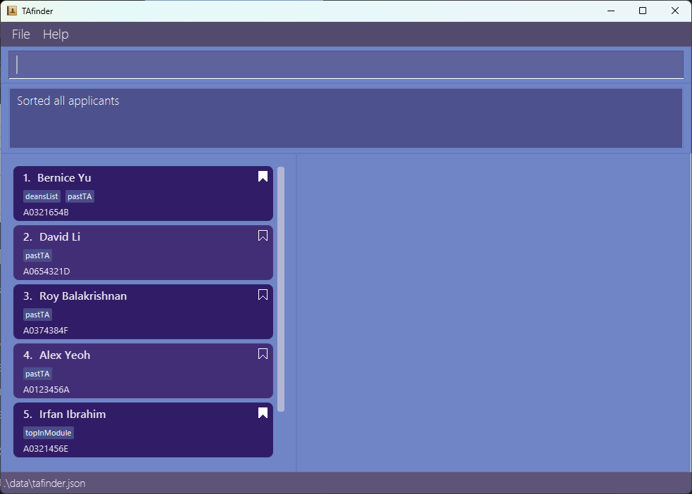 |  |

**Format:**

<div markdown="block" class="alert alert-info">

**`sort FIELD`**

**`FIELD`**: The name of the field that applicants are sorted by. <br>
* Valid fields: `name`, `studentNo`, `gpa`, `previousGrade`, `interviewScore`, `comment`, `phone`, `email`, `tags` <br>

</div>

**Expected Output:**

<div markdown="block" class="alert alert-success">

- A sorted list of applicants.

</div>

**Erroneous Outputs:**

<div markdown="block" class="alert alert-danger">

Empty list:<br>
**`"No applicants to sort."`**

</div>

---

#### Comparing 2 applicants: `compare`

Compares two applicants side by side to make informed decisions.


**Format:**

<div markdown="block" class="alert alert-info">

**`compare INDEX1 INDEX2`**

**`INDEX1`**: The index of the first applicant to compare.

**`INDEX2`**: The index of the second applicant to compare.<br>
Both indices must be a positive integer (e.g., 1, 2, 3…), and should not be the same.

</div>

**Examples:**

<div markdown="block" class="alert alert-secondary">

**`compare 1 2`**
- Compares the first and second applicants.

</div>

**Expected Outputs:**

<div markdown="block" class="alert alert-success">

- A side-by-side comparison of the two applicants is displayed in a user-friendly format.
- This comparison window will include:
  - Student number
  - Name
  - Various TA selection criteria such as:
    - GPA
    - CCA count
    - Interview Performance Rating (IPR)
    - tags
- The system highlights the differences between the two applicants, making it easy to see variations in their profiles.

</div>

**Erroneous Outputs:**

<div markdown="block" class="alert alert-danger">

Applicant not found:<br>
**`"Error: One or both of the specified applicants were not found in the list."`**

</div>

<div markdown="block" class="alert alert-danger">

Comparing the same applicant:<br>
**`"Error: Please provide distinct indices. You cannot compare the same applicant."`**

</div>

---

#### Bookmarking/Unbookmarking applicants: `bookmark/unbookmark`

Bookmarks/Unbookmarks a specific applicant.

|                        Before                         |               After                |
|:-----------------------------------------------------:|:----------------------------------:|
| 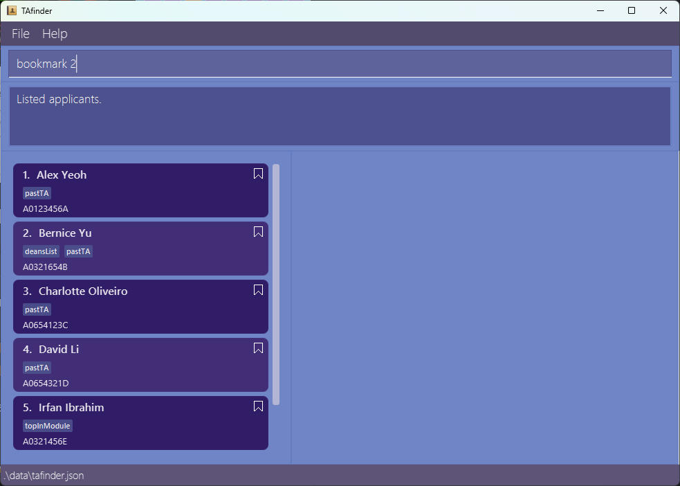 | 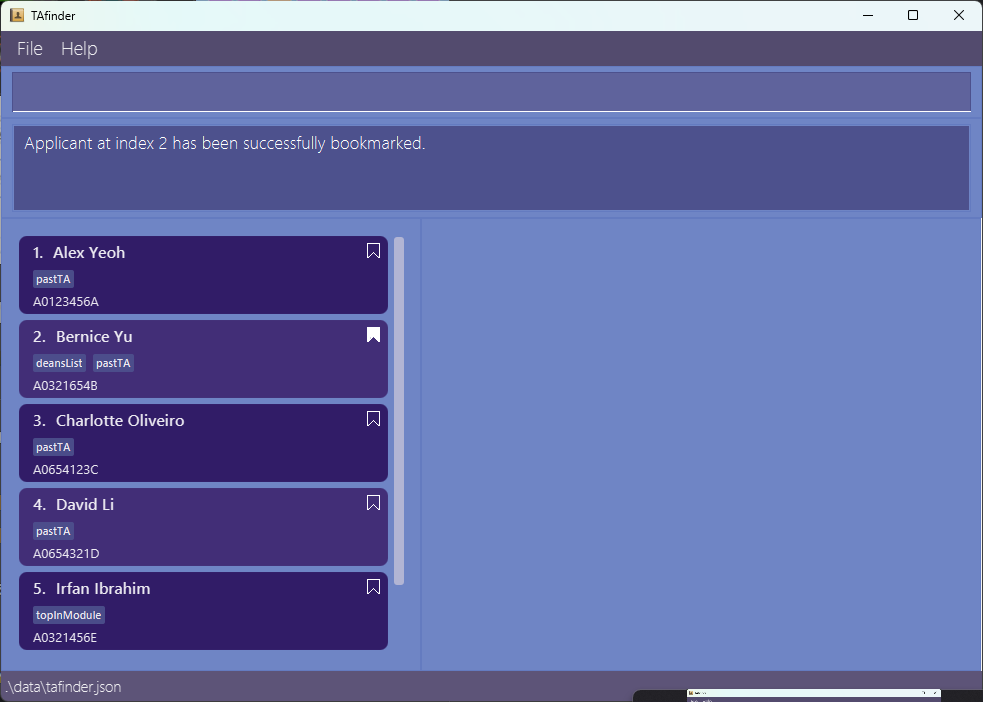 |

**Format:**

<div markdown="block" class="alert alert-info">

**`bookmark INDEX` / `unbookmark INDEX`**

**`INDEX`**: The index corresponding to the applicant to be bookmarked/unbookmarked. The index must be a positive integer (e.g., 1, 2, 3…).

</div>

**Examples:**

<div markdown="block" class="alert alert-secondary">

**`bookmark 3`**
- Bookmarks the third applicant.

</div>

<div markdown="block" class="alert alert-secondary">

**`unbookmark 3`**
- Unbookmarks the third applicant.

</div>

**Expected Outputs:**

<div markdown="block" class="alert alert-success">

- Successfully bookmark/unbookmark applicant at the given index.
- Confirmation message:<br>
**`"Applicant at index INDEX has been successfully bookmarked/unbookmarked."`**

</div>

**Erroneous Outputs:**

<div markdown="block" class="alert alert-danger">

Missing index:<br>
**`"Invalid command format!`<br>
  `bookmark: Bookmarks an applicant, identified by the index number used in the last list, from all future lists of applicants.`<br>
  `Parameter: INDEX (must be a positive integer)`<br>
  `Example: bookmark 1"`**

</div>

<div markdown="block" class="alert alert-danger">

Index out of range:<br>
**`"Error: Invalid index. Please enter an index within range."`**

</div>

---

#### Commenting on TA applicant: **`comment`**

One of yours TAs is unable to make it for the interview.
You want to make a comment on the applicant to remind yourself to follow up with him/her.
Lets find out how to do use the comment feature to do so.

**Format:**

<div markdown="block" class="alert alert-info">

**`comment INDEX c/COMMENT`**

**`INDEX`**: The index corresponding to the applicant to be commented. The index must be a positive integer (e.g., 1, 2, 3…).

The index of the applicant is the number beside the applicant's name in the list of applicants.

</div>

**Example:**

<div markdown="block" class="alert alert-secondary">

**`comment 3 c/Unable to make it for interview`**
- Comments on the third applicant with the comment: "Unable to make it for interview"

</div>

Following the example above, if you entered everything correctly, you should see the following:

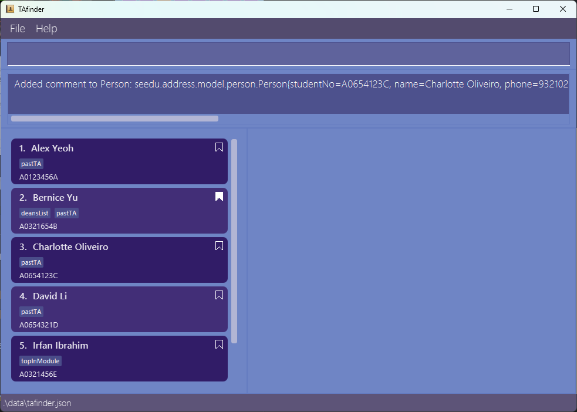

You have now successfully commented on the applicant. As you comment on more applicants in the list,
watch out for the expected and erroneous messages below that could be displayed in the command result screen!

**Expected Outputs:**

<div markdown="block" class="alert alert-success">

Successfully commenting on the applicant at the corresponding index.<br>
**`"Applicant at index INDEX has been successfully commented on."`**

</div>

**Erroneous Outputs:**

<div markdown="block" class="alert alert-danger">

Invalid command format:<br>
**`“Invalid command format!"`<br>
`"comment: Edits the comment of the person identified by the index number used in the last person listing. Existing comment will be overwritten by the input."`<br>
`"Parameters: INDEX (must be a positive integer) c/ [COMMENT]"`<br>
`"Example: comment 1 c/ Hardworking student”`**

</div>

<div markdown="block" class="alert alert-danger">

Index out of range:<br>
**`“Error: Invalid index. Please enter an index within range.”`**

</div>

---

### Files and data management

#### Importing applicants from spreadsheet: `import`

<box type="definition">

Imports an entire list of applicants along with their details from a CSV file.

</box>

|            Sample .csv             |                After import                |
|:----------------------------------:|:------------------------------------------:|
| 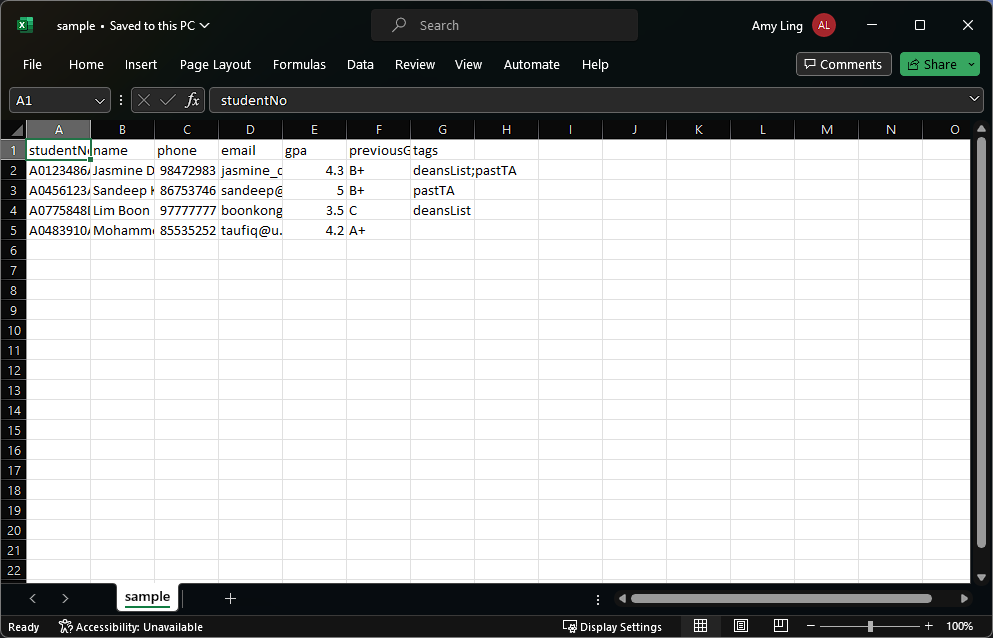 |      |

**Format:**

<div markdown="block" class="alert alert-info">

**`import FILENAME`**

**`FILENAME`**: The desired filename of the CSV file to import from (including the file extension)

</div>

**Examples:**

<div markdown="block" class="alert alert-secondary">

**`import ta-applicants.csv`**
- Imports a entire list of applicants, from a file in the CSV format called `ta-applicants.csv` in the same directory as the JAR file, into TAfinder

</div>

**Expected Output:**

<div markdown="block" class="alert alert-success">

- Successfully attaching a file to the applicant at the corresponding index.
- Sample confirmation message:<br>
**`"Imported 10 applicants successfully!"`**

</div>

**Erroneous Outputs:**

<div markdown="block" class="alert alert-danger">

Missing file permissions or invalid file path:<br>
**`"Failed to open and load applicant file."`**

</div>

---

#### Attaching file to applicant profiles: `attach`

Attaches local files to the profiles of applicants to provide even more richness and insight into their applications


**Format:**

<div markdown="block" class="alert alert-info">

**`attach INDEX f/FILEPATH`**

**`INDEX`**: The index of the applicant to edit. The index must be a positive integer (e.g., 1, 2, 3…).

**`FILEPATH`**: The desired path of the file to attach to the applicant’s profile. This is relative to the path of the JAR file unless either `/` or `C:\` is at the start of the path, then the path will be treated as an absolute path.

</div>

**Examples:**

<div markdown="block" class="alert alert-secondary">

**`attach 2 f/john-resume.pdf`**
- Attaches the file called `john-resume.pdf` in the same directory as the `tafinder.jar` file to the second applicant in the applicant list

</div>

<div markdown="block" class="alert alert-secondary">

**`attach 78 f//home/jennifer/resumes/benson-resume.pdf`**
- Attaches the file called `benson-resume.pdf` in the directory `/home/jennifer/resumes` to the 78th applicant in the applicant list

</div>

**Expected Outputs:**

<div markdown="block" class="alert alert-success">

- Successfully attaching a file to the applicant at the corresponding index.
- Sample confirmation message:<br>
**`"Attached 1 attachments to Alex Yeoh!"`**

</div>

**Erroneous Outputs:**

<div markdown="block" class="alert alert-danger">

Invalid file path or corrupted data:<br>
**`"Failed to copy attachment."`**

</div>

<div markdown="block" class="alert alert-danger">

Any other unexpected error:<br>
**`"Error: Unknown error. Please contact the app developer at contact@email.com"`**

</div>

---
## Data Management
### Saving the data

TAfinder data are saved in the hard disk automatically after any command that changes the data. There is no need to save manually.

### Editing the data file

TAfinder data are saved automatically as a JSON file `[JAR file location]/data/tafinder.json`. Advanced users are welcome to update data directly by editing that data file.

<box type="warning">

**Warning:**

If your changes to the data file makes its format invalid, TAfinder will discard all data and start with an empty data file at the next run. Hence, it is recommended to take a backup of the file before editing it.

</box>

--------------------------------------------------------------------------------------------------------------------
## Upcoming Features [coming in a future update!]

--------------------------------------------------------------------------------------------------------------------

## FAQ

**Q**: How do I transfer my data to another Computer?<br>
**A**: Install the app in the other computer and overwrite the empty data file it creates with the file that contains the data of your previous AddressBook home folder.

--------------------------------------------------------------------------------------------------------------------

## Known Issues

1. **When using multiple screens**, if you move the application to a secondary screen, and later switch to using only the primary screen, the GUI will open off-screen. The remedy is to delete the `preferences.json` file created by the application before running the application again.

--------------------------------------------------------------------------------------------------------------------
## Summary
### Prefix Summary

| Parameter      | Prefix | Rules                                                                                                                                                                                                              |
|----------------|--------|--------------------------------------------------------------------------------------------------------------------------------------------------------------------------------------------------------------------|
| Student number | s/     | - Should be in the format `AdddddddL`, <br/>where `d` represents digit and `L` represents capital letters.                                                                                                         |
| Name           | n/     | - Should only contains alphanumeric characters and spaces.                                                                                                                                                         |
| Phone          | p/     | - Should only contain digits<br/>- Should have at least 3 digits.                                                                                                                                                  |
| Email          | e/     | - Should only be of the form `local@domain` and only accept alphanumeric characters<br/>- `local` allows for special characters `+`, `_`, `.` and `-` as well.<br/>- `domain` must be at least 2 letters long<br/> |
| GPA            | g/     | - Should be in the range of 0.00 to 5.00 inclusive.<br/>- Can be given in 0, 1 or 2 decimal places.                                                                                                                |
| Comment        | c/     | - Can be any character.                                                                                                                                                                                            |
| Tag            | t/     | - Should only contain alphanumeric characters.<br/>- Should not contain spaces.                                                                                                                                    |


### Command Summary
#### Basic applicant management commands

| Action          | Format, Examples                                                                                                                                                                |
|-----------------|---------------------------------------------------------------------------------------------------------------------------------------------------------------------------------|
| **Add**         | - `add [s/STUDENT_NUMBER] [n/NAME] [p/PHONE] [e/EMAIL] [g/GPA] [t/TAG]…` <br> - e.g., `add s/A0269357C n/john doe p/91234567 e/johndoe@example.com g/5.0 t/pastTA t/deanslist` |
| **Edit**        | - `edit INDEX [n/NAME] [p/PHONE_NUMBER] [e/EMAIL] [a/ADDRESS] [t/TAG]…​`<br> - e.g.,`edit 2 n/James Lee e/jameslee@example.com`                                                 |
| **Delete**      | - `delete INDEX`<br> - e.g., `delete 3`                                                                                                                                         |
| **List**        | - `list`                                                                                                                                                                        |
| **View**        | - `view INDEX`<br> - e.g., `view 3`                                                                                                                                             |
| **Hide/Unhide** | - `hide INDEX` / `unhide INDEX`<br/> - e.g., `hide 3` / `unhide 3`                                                                                                              |

#### Applicant comparison and evaluation commands

| Action                  | Format, Examples                                                                  |
|-------------------------|-----------------------------------------------------------------------------------|
| **Sort GPA**            | - `sort-gpa`                                                                      |
| **Compare**             | - `compare INDEX1 INDEX2`<br> - e.g.,`compare 1 2`                                |
| **Bookmark/Unbookmark** | - `bookmark INDEX` / `unbookmark INDEX`<br> - e.g., `bookmark 3` / `unbookmark 3` |
| **Comment**             | - `comment INDEX COMMENT`<br/> - e.g., `comment 3 Hardworking`                    |

#### Data import and management

| Action                  | Format, Examples                                                |
|-------------------------|-----------------------------------------------------------------|
| **Import**              | - `import FILENAME`<br/> - e.g., `import ta-applicants.csv`     |
| **Attach**              | - `attach INDEX FILEPATH`<br> - e.g.,`attach 2 john-resume.pdf` |
